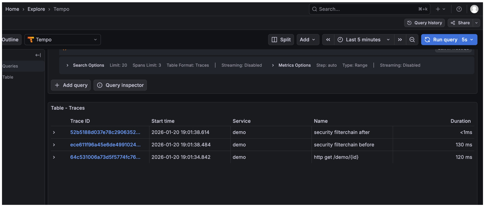
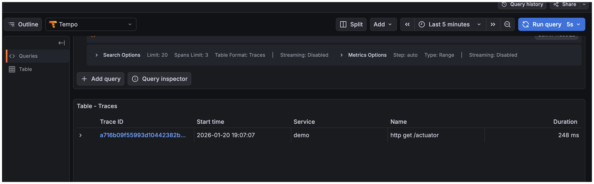

## 🐛 Incorrect Spring Security spans for Actuator endpoints on management.server.port break tracing (Spring MVC)

### Context

I’m using **Grafana OTEL LGTM** with **Tempo** to collect and visualize traces from a Spring Boot application.

When the Spring Boot **management server runs on a different port**, traces for `/actuator` endpoints are **not correctly reported** in Tempo.

---

### 🧪 Reproduction steps

#### 1. Run OTEL LGTM stack

```bash
docker run -d --name otel-lgtm \
  -p 3000:3000 \
  -p 4318:4318 \
  grafana/otel-lgtm:latest
```

#### 2. Open Grafana Tempo

```
http://localhost:3000/explore
```

Select **Tempo** as the data source.

---

#### 3. Call a regular application endpoint

use the basic-auth: `demo/demo` 

```
http://localhost:8080/demo/1
```

✅ **Result**
The trace is correctly created and visible in Tempo.

---

#### 4. Configure a dedicated management port

```yaml
management:
  server:
    port: 8089
```

---

#### 5. Call the actuator endpoint

use the basic-auth: `demo/demo` 

```
http://localhost:8089/actuator
```

❌ **Result**
The trace is **not correctly reported** in Tempo.



---

### 🔄 Comparison test

#### Remove the management port configuration

```yaml
# management:
#   server:
#     port: 8089
```

#### Call actuator on main port

use the basic-auth: `demo/demo` 

```
http://localhost:8080/actuator
```

✅ **Result**
The trace is now **correctly reported** in Tempo.



---

### ❓ Expected behavior

Traces for `/actuator` endpoints should be collected **even when `management.server.port` is different from `server.port`**, just like regular application endpoints.

---

### 📌 Actual behavior

When `management.server.port` is set:

* Application endpoints are traced correctly
* Actuator endpoints are **missing or incomplete** in Tempo

---

### 🧠 Additional notes

* OTEL exporter is configured and working (confirmed via regular endpoints)
* Issue only appears when using a **separate management server port**
* No issue when actuator runs on the main HTTP port
* No issue when using **spring-webflux** 


